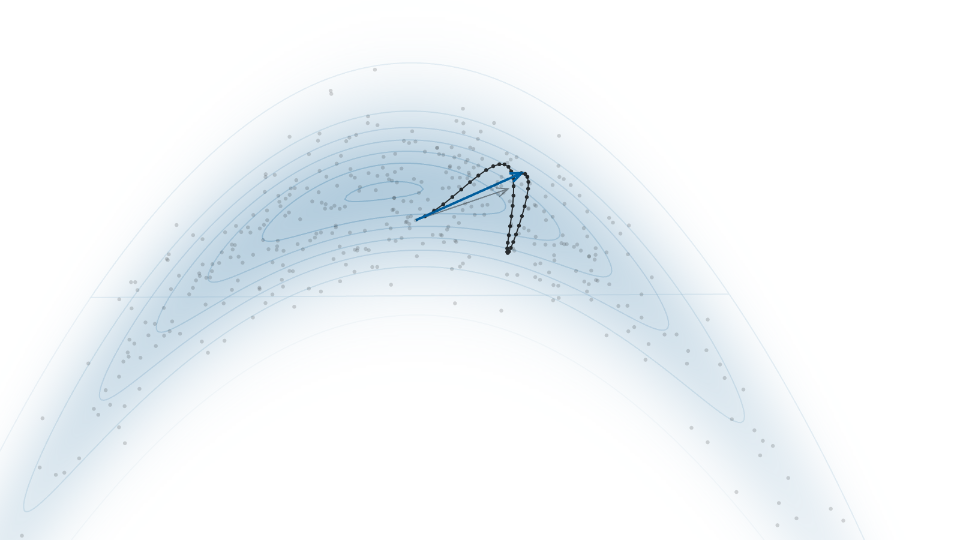

  <picture>
    <source media="(prefers-color-scheme: dark)" srcset="docs/logo-wordmark-dark.svg">
    
  </picture>

**Live demo: https://chris-nemeth.github.io/sampling-gallery/**

An interactive gallery of Markov-chain Monte Carlo (and related) sampling
algorithms — animated, tunable, and explained in plain language. Static,
buildless HTML: open it in a browser, or serve the folder.

## Pages
- `index.html` — landing atlas: all algorithms grouped by family, with
  animated thumbnails and plain-language descriptions. Links into the sampler.
- `notes.html` — field notes: a companion note for every sampler (what it
  does, what to watch while it runs, which knobs matter, references), written
  as plain markdown in `notes/*.md` and also available in-app via the "Notes"
  button in the sampler.
- `sampler.html` — the interactive app, driven by the project's real MCMC
  engine (`lib/`, `main/`, `algorithms/`): every sampler in the
  rail runs its genuine algorithm. Nine target distributions (banana / donut /
  Gaussian / mixture / funnel / squiggle / flower / swiss roll / correlated
  ridge), per-sampler tunable parameters,
  live diagnostics (steps / acceptance / mean / ESS), a 2D view with proposal
  arrows, gradients and trajectories rendered live, and a rotating 3D
  density-surface view with the chain and step geometry lifted onto it.
- `classic.html` — the original interface (`app.html`), kept for continuity:
  a full-window 2D visualizer with a lil-gui control panel.
- `styles.css` — Broadsheet design tokens + component classes.
- `notes/*.md` — the field notes source; `docs/` — thumbnails and social
  card, captured from the live engine.

## Samplers
Rejection sampling, importance sampling (with SIR and PSIS), quasi-Monte Carlo, slice sampling,
elliptical slice sampling,
Random Walk MH, Adaptive MH, HMC (optional dual-averaging step-size
adaptation), NUTS (efficient dual-averaged by default; naive tree and fixed
step size as advanced options), Riemannian-manifold HMC (SoftAbs metric),
the apogee-to-apogee path sampler (AAPS),
MALA, ULA, SGLD (optional control variates),
tuning-free ULA (FUSE), H2MC, Gibbs, ensemble MCMC (stretch and differential-evolution
moves), parallel tempering, tempered SMC (with an annealed importance
sampling mode), Zig-Zag, Bouncy Particle
Sampler, SVGD, Coin SVGD (learning-rate free), Wasserstein particle descent
(Blob, GFSD and GFSF modes), SPOS, and nested sampling. The particle methods
share a live kernel Stein discrepancy diagnostic, an attraction/repulsion
force decomposition, and selectable particle initializations.

## Run locally
Open `index.html` in any modern browser, or from the folder root:

    python3 -m http.server

then visit http://localhost:8000/

## Notes
- No build step; all libraries are vendored in `lib/` (fonts load from Google
  Fonts when online; the pages remain functional offline).
- Every sampler runs the real, tested implementation from `algorithms/` —
  there are no placeholder fall-backs.
- Redesigned in the Broadsheet system; based on the original demo by Chi Feng:
  https://github.com/chi-feng/mcmc-demo

## Using this in teaching
Please do — that is what it is for. Link to the live site or to a specific
sampler/target (e.g. `sampler.html?algorithm=RiemannianHMC&target=funnel`);
the field notes at `notes.html` are written as companion reading. If you use
the gallery in a course or talk, a link back here is appreciated.

## Acknowledgements & licensing
Built from Chi Feng's wonderful
[mcmc-demo](https://github.com/chi-feng/mcmc-demo) (MIT). Nested sampling
adapts Johannes Buchner's
[ultranest-js](https://github.com/JohannesBuchner/ultranest-js)
(`algorithms/NSRadFriends.js`, AGPL-3.0 — the one non-MIT file; see LICENSE).
Markdown rendering by [marked](https://github.com/markedjs/marked) (MIT).
Algorithm sources are cited in the gallery's reference list and in each
field note.
